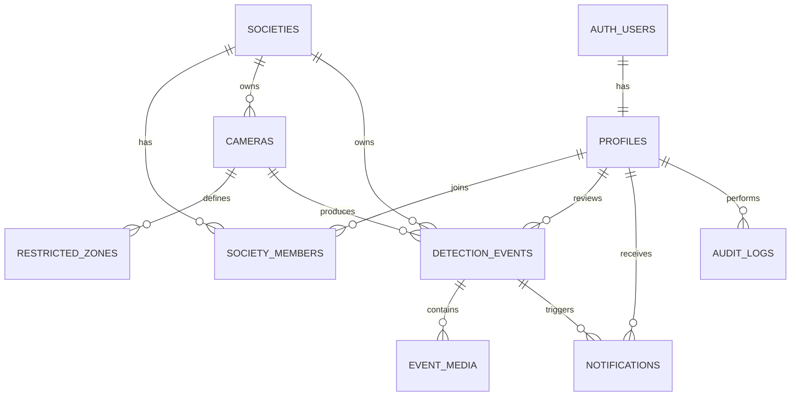

# Initial Database Design

## Entity Relationship Diagram



## Enumerations

### Platform role

- `super_admin`
- `user`

### Society role

- `society_admin`
- `operator`

### Camera source

- `mobile`
- `webcam`
- `rtsp`
- `recorded_video`

### Camera status

- `pending`
- `online`
- `offline`
- `disabled`
- `error`

### Event status

- `new`
- `under_review`
- `confirmed`
- `false_positive`
- `resolved`

## Tables

### profiles

Extends Supabase `auth.users`.

| Column | Type | Notes |
|---|---|---|
| id | uuid | Primary key and auth user ID |
| full_name | text | Display name |
| platform_role | enum | `super_admin` or `user` |
| avatar_url | text | Optional |
| created_at | timestamptz | Creation time |
| updated_at | timestamptz | Last update |

### societies

| Column | Type | Notes |
|---|---|---|
| id | uuid | Primary key |
| name | text | Society name |
| slug | text | Unique URL-safe identifier |
| address | text | Optional |
| timezone | text | IANA timezone |
| is_active | boolean | Platform access switch |
| created_by | uuid | References profiles |
| created_at | timestamptz | Creation time |
| updated_at | timestamptz | Last update |

### society_members

| Column | Type | Notes |
|---|---|---|
| id | uuid | Primary key |
| society_id | uuid | References societies |
| user_id | uuid | References profiles |
| role | enum | Admin or operator |
| is_active | boolean | Membership status |
| created_at | timestamptz | Creation time |

Unique constraint: `(society_id, user_id)`.

### cameras

| Column | Type | Notes |
|---|---|---|
| id | uuid | Primary key |
| society_id | uuid | Required owner |
| name | text | Camera display name |
| location_label | text | Human-readable location |
| source_type | enum | Mobile, webcam, RTSP, or video |
| status | enum | Current state |
| device_token_hash | text | Never store raw token |
| stream_config | jsonb | Private source-specific settings |
| detection_enabled | boolean | AI processing switch |
| confidence_threshold | numeric | Per-camera threshold |
| confirmation_seconds | integer | Stationary-object delay |
| last_seen_at | timestamptz | Health indicator |
| created_by | uuid | References profiles |
| created_at | timestamptz | Creation time |
| updated_at | timestamptz | Last update |

RTSP credentials must not be exposed to browser clients.

### restricted_zones

| Column | Type | Notes |
|---|---|---|
| id | uuid | Primary key |
| society_id | uuid | Required for RLS |
| camera_id | uuid | References cameras |
| name | text | Zone name |
| polygon | jsonb | Normalized points from 0 to 1 |
| is_active | boolean | Zone switch |
| created_at | timestamptz | Creation time |
| updated_at | timestamptz | Last update |

Example polygon:

```json
[
  { "x": 0.15, "y": 0.55 },
  { "x": 0.86, "y": 0.55 },
  { "x": 0.92, "y": 0.94 },
  { "x": 0.10, "y": 0.94 }
]
```

Normalized coordinates allow the same zone to work at different video
resolutions.

### detection_events

| Column | Type | Notes |
|---|---|---|
| id | uuid | Primary key |
| society_id | uuid | Required owner |
| camera_id | uuid | Source camera |
| zone_id | uuid | Triggered zone |
| event_type | text | Initially `possible_littering` |
| status | enum | Review lifecycle |
| object_class | text | Bottle, cup, bag, etc. |
| confidence | numeric | Event confidence |
| detected_at | timestamptz | Event time |
| metadata | jsonb | Track IDs and model details |
| reviewed_by | uuid | Nullable profile reference |
| reviewed_at | timestamptz | Nullable |
| review_notes | text | Nullable |
| created_at | timestamptz | Creation time |

### event_media

| Column | Type | Notes |
|---|---|---|
| id | uuid | Primary key |
| society_id | uuid | Required for RLS |
| event_id | uuid | References detection event |
| media_type | text | `image` or `video` |
| storage_path | text | Private bucket path |
| captured_at | timestamptz | Evidence time |
| created_at | timestamptz | Creation time |

Suggested path:

```text
societies/{society_id}/events/{event_id}/{filename}
```

### notifications

| Column | Type | Notes |
|---|---|---|
| id | uuid | Primary key |
| society_id | uuid | Required for RLS |
| user_id | uuid | Recipient |
| event_id | uuid | Related event |
| title | text | Short title |
| is_read | boolean | Read state |
| created_at | timestamptz | Creation time |

### audit_logs

| Column | Type | Notes |
|---|---|---|
| id | uuid | Primary key |
| society_id | uuid | Nullable for platform actions |
| actor_id | uuid | User performing action |
| action | text | Stable action identifier |
| entity_type | text | Affected entity |
| entity_id | uuid | Affected row |
| metadata | jsonb | Additional context |
| created_at | timestamptz | Creation time |

## Row Level Security Rules

1. Super admins can manage all platform data.
2. Society members can read active data belonging to their society.
3. Society admins can create and update their society's cameras and zones.
4. Operators can read cameras and update incident review fields only.
5. Camera devices cannot use normal user permissions.
6. The inference service uses a restricted server credential and validates the
   camera token before writing events.
7. Storage access follows the same society membership rules.

## Required Indexes

- `society_members(user_id, society_id)`
- `cameras(society_id, status)`
- `cameras(last_seen_at)`
- `restricted_zones(camera_id, is_active)`
- `detection_events(society_id, detected_at desc)`
- `detection_events(camera_id, detected_at desc)`
- `detection_events(status, detected_at desc)`
- `notifications(user_id, is_read, created_at desc)`
- `audit_logs(society_id, created_at desc)`

